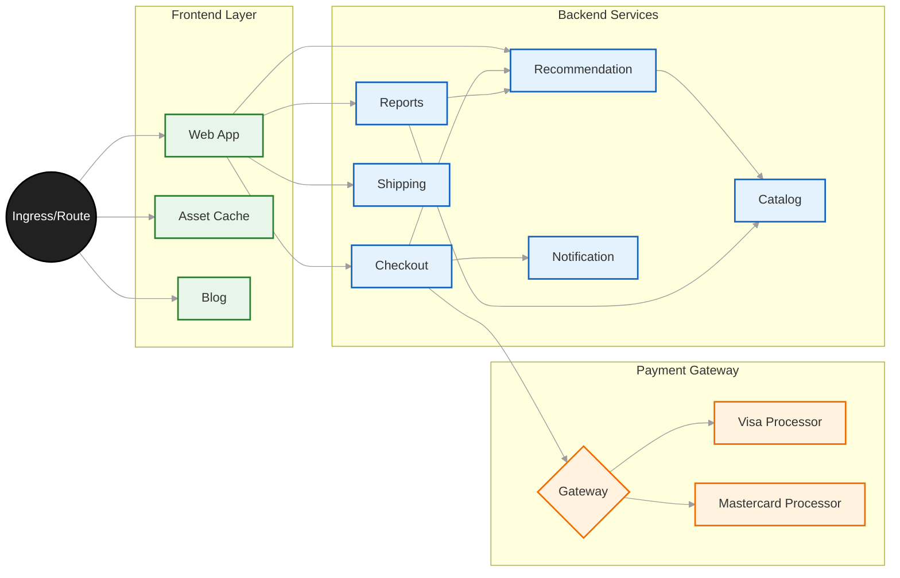
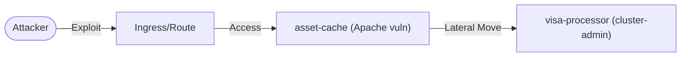

## Legal Disclaimer

This project is done for educational and ethical testing purposes only. Attacking targets without prior mutual consent is illegal. It is the end user's responsibility to obey all applicable local, state and federal laws. Developers assume no liability and are not responsible for any misuse or damage caused by this program.

## Introduction

Welcome to our demo environment, where we showcase our comprehensive approach to securing modern application architectures. In this environment, we focus on critical areas of security: Applying Security Best practices ( Or not ), vulnerability management, runtime detection and response, network segmentation, defence in depth, and applying the least privileges. The demo environment also includes runtime detection and response capabilities, allowing you to detect and respond to threats in real time, including detecting zeroday attacks. Finally, our demo environment showcases the importance of network segmentation in securing modern application architectures.

## Installing

```
git clone https://github.com/ralvares/security-demos
cd manifests
oc apply -k .
```

## RHACS/Stackrox

TBD

## Demo Diagram



## Attack Description

In this scenario, the attacker starts by gaining access to "asset-cache," which may have a vulnerability that the attacker can exploit to gain control of the container. Once the attacker has control of "asset-cache," they then use it as a jumping-off point to try and gain access to "visa-processor."

To do this, the attacker may use exploits or other techniques to move laterally within the network, potentially taking advantage of vulnerabilities in other containers or network components to gain access to additional systems. Once the attacker has gained access to "visa-processor," they may attempt to establish persistence within the network, allowing them to maintain access even if their initial entry point is discovered and blocked.

## Attack Flow



## Attack Environment

 The "asset-cache" is a web server running a version of Apache with a vulnerability (CVE-2021-42013) and exposed to the internet via Route/ingress, which means it has a weakness that the attacker can exploit to gain access to the system.

Remember that the vulnerability scanner cannot identify the vulnerability because the web server was built from source code, which means it was custom-made rather than downloaded as a pre-made package.

The plan is to use the "asset-cache" as a stepping stone to access a workload called "visa-processor" that is running in the "payments" namespace. 
There is no network segmentation within the cluster, which means that once they gain access to one part of the system, it will be relatively easy for them to move laterally and access other parts of the system.

The "visa-processor" service account within the cluster has cluster-admin privileges. If the attacker has access to a token or credentials that allow them to authenticate with the Kubernetes cluster as the "visa-processor" service account (which has cluster-admin privileges), they would have significant power within the cluster.

With this level of access, the attacker could use a command-line tool called "kubectl" to execute commands on any of the containers running within the cluster. For example, they could use the "kubectl exec" command to execute arbitrary commands on a running container, which could potentially give them access to sensitive information or allow them to modify the behaviour of the container in malicious ways.

Alternatively, the attacker could use "kubectl" to create a new namespace within the cluster, and then deploy their own containers within that namespace. This would allow them to run their own code within the cluster, potentially giving them even greater access and control over the system.

Overall, the level of access provided by the "visa-processor" service account within the Kubernetes cluster represents a significant security risk. Organizations must ensure appropriate security measures are in place to prevent unauthorized access.

### Mitigations

To mitigate the security risks outlined in the previous conversation, I would recommend starting with the following steps:

- Upgrade the software running on the containers, including Apache and any other software that may be vulnerable to attack. Keeping software up-to-date is an essential step in ensuring that known security vulnerabilities are addressed.

- Apply the principle of least privilege to the "visa-processor" service account. Specifically, remove the cluster admin privileges from the service account and only provide it with the permissions that are required for it to perform its intended functions.

- configure the container to listen on a higher port, such as port 8080, so that it does not require root access. Running containers as non-root users is generally considered a best practice for security.

- Apply network policies to enforce network segmentation within the Kubernetes cluster. This can help prevent lateral movement by attackers who gain access to one part of the system.

### Generating Network Policies using roxctl
Follow how simple is to create network policies using roxctl generate netpol 
```
git clone https://github.com/ralvares/security-demos
cd security-demos/manifests
roxctl netpol generate --dnspor=5353 . | oc apply -f -
```

By following these steps, organizations can reduce the likelihood of a successful attack against their Kubernetes cluster, and limit the damage that an attacker could cause if they were able to gain access to the system. It is important to keep in mind, however, that security is an ongoing process and requires regular attention and maintenance to stay effective.

## Scripts

The scripts are designed to demo a few security use cases, meaning the target are hardcoded ( asset-cache and visa-processor ).

- **01_expoit_asset-cache_get_visa_token.sh** will use asset-cache as a steping stone to access the visa-processe service account token.

```
Security Demo -> cd attack
Security Demo -> ./01_expoit_asset-cache_get_visa_token.sh http://asset-cache-frontend.apps.<CLUSTER.DOMAIN>/                
☺ - Target asset-cache-84bc5779ff-lsq2n Exploited
☺ - Next Phase: Lateral Movement ...
☺ - Exploiting visa-processor workload ...
☺ - Target visa-processor-6d764fc488-qzjxl Exploited
☺ - Token extracted from visa-processor-6d764fc488-qzjxl
 ☣☣☣ Checking Token Privileges ☣☣☣
☺ - kubernetes.default.svc:443 Access Confirmed from asset-cache-84bc5779ff-lsq2n
☺ - Token with cluster-admin Privileges Confirmed
☣☣☣ Happy Hacking ☣☣☣

Security Demo -> cat token
eyJhbGciOiJSUzI1NiIsImtpZCI6ImNsbXFWcGppX1BQX1NHd....
```