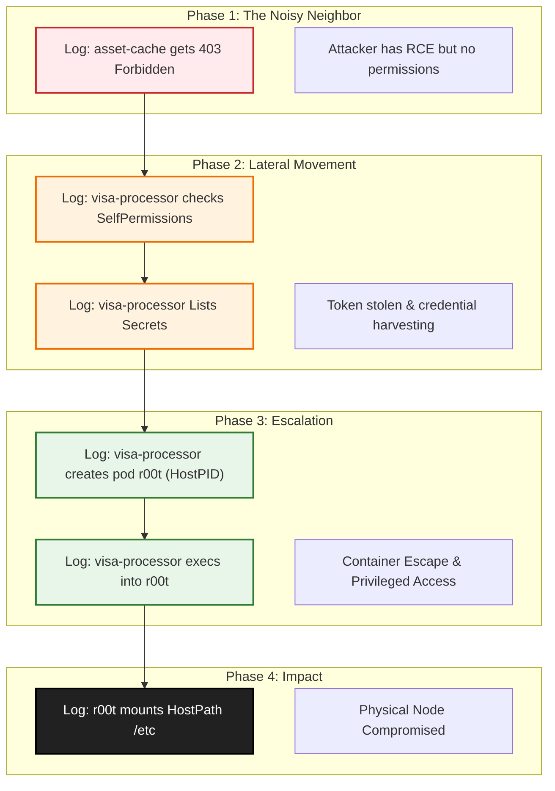

# Forensic Engineering: The OpenShift Audit Log Investigation

## Part 1: The Immutable Truth

In any production cluster, observability is crucial. Metrics such as CPU usage, memory consumption, and latency provide insights into the **health** of applications and infrastructure. However, during a security incident, the focus shifts from **health** to **accountability** and **intent**.

Audit logs become indispensable in these scenarios. They serve as the definitive record of actions within the cluster, enabling forensic analysis to uncover the **who**, **what**, **when**, **where**, and **why** of every interaction. This shift in focus underscores the importance of maintaining comprehensive and immutable audit logs to ensure clarity and accountability during critical investigations.

This is where the OpenShift Audit Log becomes the most critical tool in your arsenal. It is the authoritative record of the Control Plane, capturing the **5 Ws** of every interaction with the API Server: **Who**, **What**, **Where**, **When**, and the **Decision** (RBAC).

### The Critical Prerequisite: Log Forwarding

Before we start the hunt, we must address the most important rule of forensic logging: **Storage Integrity.**

Audit logs are generated on the Master nodes. If an attacker successfully escalates privileges and takes over the node (Root compromise), they can technically wipe the log files on that server to cover their tracks.

Therefore, for these logs to be legally and forensically valid, they **must be forwarded** to an external, system (like Splunk, Elastic, or a remote syslog server). In this architecture, even if the attacker burns the cluster to the ground, the evidence of *how* they did it remains safe in your external SIEM.

-----

## Part 2: The Incident Scenario

We are investigating a suspected breach of our "Visa Payment" application. Intelligence suggests a sophisticated Kill Chain involving two specific workloads:

  * **Frontend:** `asset-cache` (Namespace: `frontend`)
  * **Payments:** `visa-processor` (Namespace: `payments`)

**The Attack Theory:**

1.  **Application Exploit:** The attacker exploited a vulnerability in the `asset-cache` code. Because this is an application-level exploit, **the Audit Log is blind to it**.
2.  **The "Loud" Failure:** The attacker tried to talk to the API from `asset-cache` but failed because that account is locked down.
3.  **Lateral Movement:** They pivoted to the `visa-processor`, stole the token, and found it had `cluster-admin` rights due to a misconfiguration in the RoleBinding, which granted excessive privileges to the service account.
4.  **The Trigger:** The moment the attacker uses that stolen token to talk to the OpenShift API, they step out of the shadows and into our logs.

We will now switch to the terminal to reconstruct this timeline using **Behavioral Analysis**.

-----

## Part 3: The Investigation

### Step 1: Investigating the Entry Point

We start by checking our compromised frontend, `asset-cache`. We know this pod was breached via an RCE (Remote Code Execution).

Since this service account should have no permissions, any attempt by the attacker to use `kubectl` from inside this pod should result in an "Access Denied" error. A attacker checks if they can list pods or secrets.

We search for `403 Forbidden` responses associated with the `asset-cache` identity.

```bash
echo "--- Hunting for Failed API Attempts (Frontend) ---"
grep '"user":{"username":"system:serviceaccount:frontend:asset-cache"' audit.log | \
grep '"responseStatus":{"code":403}' | \
jq '{
  time: .requestReceivedTimestamp,
  user: .user.username,
  verb: .verb,
  resource: .objectRef.resource,
  ALERT: "Unauthorized API Call Blocked"
}'
```

**The Finding:**
We see multiple entries. The attacker tried to `list secrets` and `get pods` using the `asset-cache` token, but OpenShift blocked them (403).

  * **Forensic Insight:** This confirms the pod is compromised, but the attacker hit a wall. They need a better token.

### Step 2: Detecting Reconnaissance (The "Who am I?" Check)

Exploiting the lack of NetworkPolicies, the attacker moved laterally to the `visa-processor` pod and abused a known vulnerability in its outdated Apache Struts to gain access and steal the token. Proper patching and scoped network controls would have blocked this path.

Now they have a new identity. But they don't know what permissions this token holds. Is it Read-Only? Is it Admin? To find out, they must ask the API.

A legitimate payment application is deterministic—it writes to databases, it processes transactions. It **never** asks, *"What are my admin rights?"*

We hunt for `SelfSubjectAccessReviews`. This API call is the digital equivalent of a user running `can-i`. It is a high-fidelity signal of a human manually enumerating permissions.

```bash
echo "--- Hunting for Privilege Enumeration (Payments) ---"
grep '"user":{"username":"system:serviceaccount:payments:visa-processor"' audit.log | \
grep '"resource":"selfsubjectaccessreviews"' | \
jq '{
  time: .requestReceivedTimestamp,
  user: .user.username,
  action: "Checking Permissions (Recon)",
  decision: .annotations["authorization.k8s.io/decision"]
}'
```

**The Finding:**
We see the `visa-processor` identity querying the cluster to check its own capabilities. The "Robot" has become self-aware. This confirms the token is compromised and the attacker knows they are now Admin.

### Step 3: Detecting Harvesting (Data Exfiltration)

Now that they know they are Admin, they start looking for other secrets to establish persistence or move to other clouds (AWS keys, etc.).

A payment processor should only mount the specific secrets it needs at boot time. It should **never** attempt to list **all** secrets in the cluster.

We query for the `list` verb on the `secrets` resource performed by this account.

```bash
echo "--- Hunting for Secret Harvesting ---"
grep '"user":{"username":"system:serviceaccount:payments:visa-processor"' audit.log | \
grep '"resource":"secrets"' | \
grep '"verb":"list"' | \
jq '{
  time: .requestReceivedTimestamp,
  user: .user.username,
  action: "Listing All Secrets",
  response: .responseStatus.code
}'
```

**The Finding:**
We see a `200 OK` response. The compromised payment processor has successfully listed all secrets. The attacker has harvested credentials.

### Step 4: The "Smoking Gun" (Host Escape)

The attacker decides to escalate to the underlying Node. They need to deploy a new workload with specific security violations: `hostPID: true` or `privileged: true`.

Sophisticated attackers will randomize the pod name (e.g., `payment-helper-v2`) to blend in. We don't care about the name. We care about the **Capability Request**.

We scan the JSON Request Body for `hostPID: true`, which would allow the container to see every process running on the Linux host (including Root processes).

```bash
echo "--- Hunting for Container Escape Vectors ---"
cat audit.log | jq 'select(.verb == "create" and .objectRef.resource == "pods") | 
select(.requestObject.spec.hostPID == true) |
{
  time: .requestReceivedTimestamp,
  user: .user.username,
  pod_name: .objectRef.name,
  DANGER: "HostPID Requested - Node Compromise Risk"
}'
```

**The Finding:**
We match a request. The `visa-processor` identity created a pod named `r00t` with HostPID access.

### Step 5: The Backdoor (Interactive Tunneling)

Finally, now that the privileged `r00t` pod is running, the attacker needs to enter it to execute their attack on the host. **This** is where we finally see the `exec` call.

```bash
echo "--- Hunting for Tunneling into Privileged Pods ---"
grep '"subresource":"exec"' audit.log | \
grep '"objectRef.name":"r00t"' | \
jq '{
  time: .requestReceivedTimestamp,
  user: .user.username,
  target_pod: .objectRef.name,
  command: .requestURI
}'
```

**The Finding:**
The `visa-processor` identity is opening a shell (`/bin/bash`) inside the `r00t` pod.

The "loop is closed" only means the attacker has established their connection. You are absolutely right—we haven't seen the *impact* yet. The `r00t` pod wasn't the goal; it was the **vehicle** to get to the host.

Here is the final, critical chapter of the investigation: **The Node Compromise**.

-----

### Step 6: The Node Takeover

The attacker is now inside the `r00t` pod. But this pod has `hostPID: true` and is privileged. This means inside the container, they are effectively `root` on the actual OpenShift Node.

They will now attempt to use `nsenter` to "break out" of the container namespace and enter the host's actual filesystem. This is often harder to spot in Audit Logs because once they are "on the node" as root, they might stop talking to the Kubernetes API and start issuing standard Linux commands (which Audit Logs don't see).

**However**, they almost always make one final, noisy API call to verify their persistence or access cloud metadata.

We look for the `r00t` pod accessing sensitive host paths or cloud metadata services.

```bash
echo "--- Hunting for Host Filesystem Access ---"
# We look for the 'r00t' pod mounting sensitive host paths
cat audit.log | jq 'select(.objectRef.name == "r00t") | 
select(.requestObject.spec.volumes[].hostPath != null) |
{
  time: .requestReceivedTimestamp,
  pod: .objectRef.name,
  mounted_path: .requestObject.spec.volumes[].hostPath.path,
  ALERT: "Host Path Mount Detected"
}'
```

**The Finding:**
We see the pod mounting `/` (the root filesystem) or `/etc` to `/host`.

  * **Forensic Insight (CoreOS):** With host access, the attacker won’t typically modify immutable system files. Instead, they can create or modify static pods (e.g., via `/etc/kubernetes/manifests`), enumerate running containers and processes, scrape in-memory secrets and environment variables, access container runtime sockets, and harvest credentials/configs present on the node to persist and expand control.

-----

## Forensic Timeline

We have now reconstructed the *entire* Kill Chain, from the first failed probe to total infrastructure compromise.



## Conclusion

We have reconstructed the crime scene using only the Audit Logs, mapping the attack to the **MITRE ATT\&CK** framework:

1.  **Asset-Cache (Frontend):** `403 Forbidden` on API calls. *Conclusion: Compromised, but contained by RBAC.*
2.  **Visa-Processor (Lateral Move):** `SelfSubjectAccessReview`. *Conclusion: Token stolen, Reconnaissance detected.*
3.  **Visa-Processor (Exfiltration):** `List Secrets`. *Conclusion: Credential Harvesting.*
4.  **Visa-Processor (Escalation):** Deployed `r00t` with `HostPID`. *Conclusion: Container Escape.*
5.  **Visa-Processor (Action):** Executed shell in `r00t`. *Conclusion: Node Takeover.*