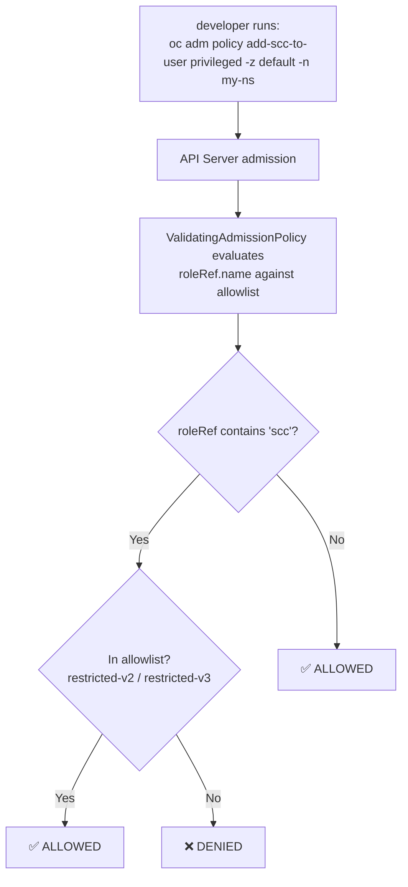

# Demo: Blocking Privileged SCC Grants with ValidatingAdmissionPolicy

In OpenShift, Security Context Constraints (SCCs) control what a pod is allowed to do at runtime. However, the act of **granting** an SCC to a ServiceAccount is an RBAC operation — which means it normally bypasses SCC enforcement entirely. A developer with the right RBAC permissions can quietly grant `privileged` or `anyuid` to a ServiceAccount and no SCC policy will stop them.

This demo shows how to use a **ValidatingAdmissionPolicy (VAP)** to intercept those RBAC writes and enforce an SCC allowlist at the API level, before any binding is persisted.

---

## How It Works

When `oc adm policy add-scc-to-user` runs, OpenShift creates or updates a `RoleBinding` (or `ClusterRoleBinding`) whose `roleRef` points to a cluster role named like `system:openshift:scc:<scc-name>`. The VAP watches for exactly these objects and rejects any binding that references an SCC outside the approved list.



---

## 1. Set Up the Demo Namespace

```bash
oc create ns demo-vulnerability-test
oc label ns demo-vulnerability-test security-enforcement=demo
```

The label `security-enforcement=demo` is used by the policy binding to scope enforcement to this namespace only.

---

## 2. Deploy the ValidatingAdmissionPolicy

The policy inspects every `RoleBinding` and `ClusterRoleBinding` write. If the `roleRef` name contains `scc`, it must be one of the approved variants.

```bash
oc apply -f - <<EOF
apiVersion: admissionregistration.k8s.io/v1
kind: ValidatingAdmissionPolicy
metadata:
  name: scc-version-allowlist
spec:
  failurePolicy: Fail
  matchConstraints:
    resourceRules:
    - apiGroups: ["rbac.authorization.k8s.io"]
      apiVersions: ["v1"]
      operations: ["CREATE", "UPDATE"]
      resources: ["rolebindings", "clusterrolebindings"]
  validations:
    - expression: |
        !object.roleRef.name.contains('scc') || 
        object.roleRef.name in [
          'system:openshift:scc:restricted-v2',
          'system:openshift:scc:restricted-v3'
        ]
      message: "Security violation: Only 'restricted-v2' and 'restricted-v3' SCC roles are allowed."
EOF
```

**CEL expression breakdown:**

| Part | Meaning |
|------|---------|
| `!object.roleRef.name.contains('scc')` | Pass through — this binding has nothing to do with an SCC |
| `object.roleRef.name in [...]` | Allow only the listed safe SCCs |
| Combined with `\|\|` | Deny if it IS an SCC role AND it's not in the allowlist |

---

## 3. Bind the Policy to the Demo Namespace

The `ValidatingAdmissionPolicyBinding` scopes enforcement to namespaces labeled `security-enforcement: demo`. Removing the label from a namespace opts it out of enforcement.

```bash
oc apply -f - <<EOF
apiVersion: admissionregistration.k8s.io/v1
kind: ValidatingAdmissionPolicyBinding
metadata:
  name: scc-demo-binding
spec:
  policyName: scc-version-allowlist
  validationActions: [Deny]
  matchResources:
    namespaceSelector:
      matchLabels:
        security-enforcement: "demo"
EOF
```

---

## 4. Attempt the Blocked Operation

Try to grant the `privileged` SCC to the `default` ServiceAccount in the demo namespace:

```bash
oc adm policy add-scc-to-user privileged -z default -n demo-vulnerability-test
```

**Expected result — request is denied at the API level:**

```
Error from server (Invalid): rolebindings "system:openshift:scc:privileged" is invalid: :
ValidatingAdmissionPolicy 'scc-version-allowlist' with binding 'scc-demo-binding' denied
request: Security violation: Only 'restricted-v2' and 'restricted-v3' SCC roles are allowed.
```

The binding is **never written to etcd**. There is no object to clean up.

---

## 5. Verify Allowed SCCs Still Work

Confirm that the approved SCCs are not blocked:

```bash
# These should succeed
oc adm policy add-scc-to-user restricted-v2 -z default -n demo-vulnerability-test
oc adm policy add-scc-to-user restricted-v3 -z default -n demo-vulnerability-test
```

---

## 6. Key Takeaways

- **Gap in SCC-only enforcement:** SCCs control pod runtime behavior, but they don't prevent an authorized user from *granting* a dangerous SCC via RBAC. VAP closes this gap.
- **Admission-time enforcement:** The request is rejected before it is persisted — no pod needs to fail, no binding needs to be rolled back.
- **Namespace-scoped by label:** The binding uses a `namespaceSelector`, making it easy to enforce on specific environments (e.g., production, regulated namespaces) without affecting others.
- **CEL expressions are auditable:** The policy logic lives as plain text in a Kubernetes object, reviewable with `oc get validatingadmissionpolicy scc-version-allowlist -o yaml`.

---

## 7. Cleanup

```bash
oc delete validatingadmissionpolicybinding scc-demo-binding
oc delete validatingadmissionpolicy scc-version-allowlist
oc delete ns demo-vulnerability-test
```

