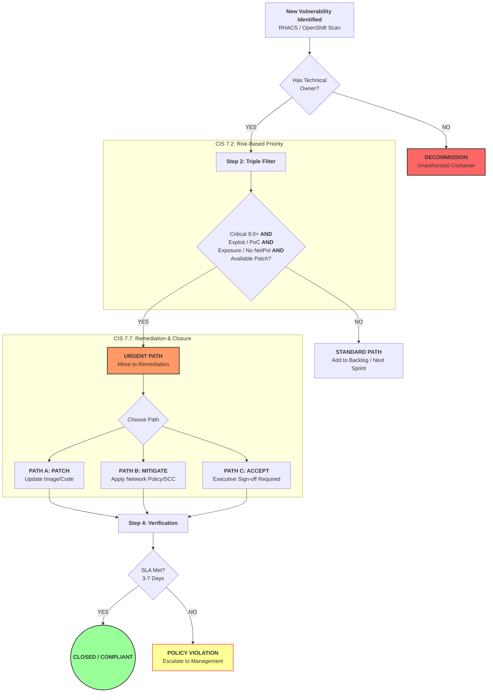

## The CIS-Driven Vulnerability Management Program (VMP)

**Framework Reference:** CIS Control 07 (v8): *Continuous Vulnerability Management*

This program is built on four distinct "Workstreams" that transition the organization from a **reactive posture** to a **data-driven security program.**

### 1. The Inventory Baseline (CIS Control 7.1)

**Goal:** You cannot secure what you haven't identified.

* **The Rule:** Maintain a clear list of every container image authorized to run in the cluster.
* **The Action:** Create a "Namespace Registry." Every OpenShift project must have a designated **Technical Owner**.
* **The Response:** If the tool finds a vulnerability, identify the owner. If no owner exists, the container is unauthorized (CIS 7.1) and should be decommissioned.

### 2. Automated Vulnerability Scanning (CIS Control 7.5)

**Goal:** Use the tool for continuous discovery.

* **The Rule:** Perform automated scans of all software at least weekly (or more frequently).
* **The Action:** Schedule automated scans to run continuously across all environments (Dev, Test, Prod).
* **The Response:** Review the "Top Risk" dashboard every Monday morning. This is your **"Weekly Risk Review."**

### 3. Risk-Based Triage (CIS Control 7.2)

**Goal:** Shift focus from total CVE volume to **Exploitable Risks**.

* **The Rule:** Prioritize remediation based on the risk to the enterprise.
* **The Action (Risk Prioritization):** Use a **Risk Scoring Criteria** to decide what to fix:
1. **Severity:** Is it a 9.0+ CVSS (Critical)?
2. **Exploitability:** Is there a **Workable PoC**, **Weaponized Exploit**, or **Known Exploit** in the wild?
3. **Exposure:** Is the asset **Internet-Facing** or missing **Network Policies**?
4. **Fixability:** Is there an available patch or newer version?

* **The Response:** If a CVE meets all four criteria, it is designated as **Critical Priority**. Everything else is secondary.

### 4. The Remediation (CIS Control 7.7)

**Goal:** Define the "Time-to-Remediate" and the path to closure.

* **The Action (The SLA):** The organization must agree on these windows:
* **Critical Risk:** Fix within **3 to 7 Days**.
* **High Risk:** Fix within **30 Days**.

* **The Closure Paths:** Every finding must end in one of three ways:
* **Path A (Patch):** Developer updates the image/code.
* **Path B (Mitigate):** The team applies **Compensating Controls** (e.g., Network Policies or SCCs).
* **Path C (Accept):** A business leader signs off on the risk for a set time period.

* **The Response:** If a "Critical" persists past Day 7, it is escalated as a **Policy Violation**.

---

## CIS Control 7: Vulnerability Triage Flowchart

---

## Summary

> "Security tools provide the data; the Vulnerability Management Program provides the **decision framework**.
> By applying a strict **Risk Prioritization** process, we convert thousands of raw alerts into a manageable set of actionable tasks focused on actual business risk."

---