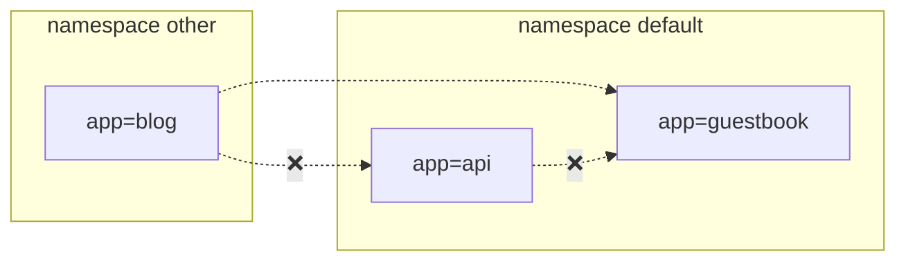
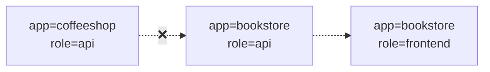
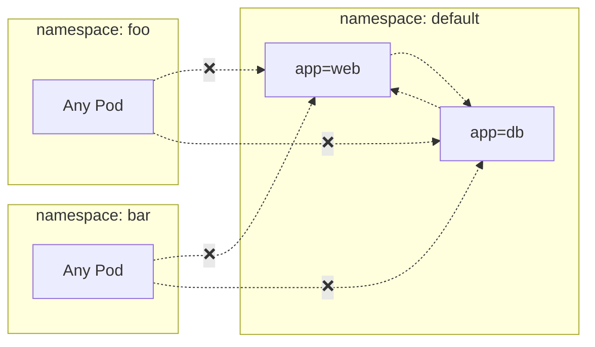
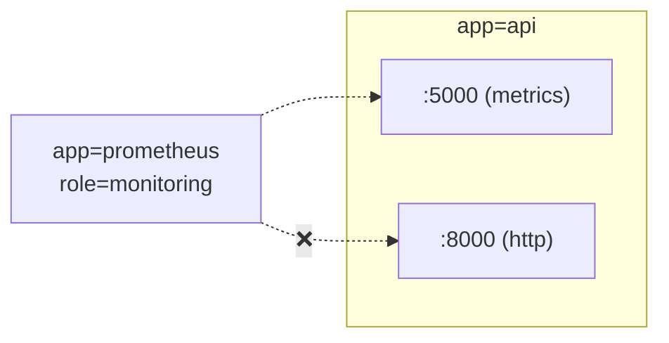
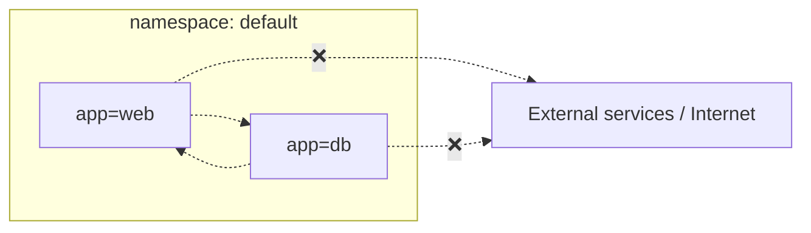
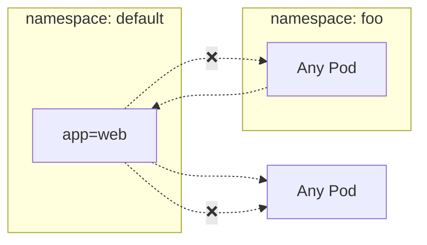

# Network Policies

## What Are Network Policies

By default, Kubernetes behaves as if it trusts everything in your cluster. All pods can talk to all other pods, on all ports, at all times.

Network Policies flip this around. They let you define, at L3/L4 (IP + port):

* Which pods may receive traffic (Ingress)
* Which pods may send traffic (Egress)
* Which namespaces or external IPs are allowed
* Which ports and protocols are open

If your namespace has no Network Policies, then:

* All pods are considered non-isolated
* All traffic is allowed in and out

This is still true in the latest GA API.

Once any NetworkPolicy selects a pod for ingress or egress isolation, that traffic direction becomes restricted, and you must explicitly allow what you want.

A NetworkPolicy flips that model:

* It selects a group of pods
* It defines whether we’re controlling ingress, egress, or both
* It lists exactly who is allowed to communicate

Anything not explicitly allowed becomes denied.

NetworkPolicies give you:

* **Isolation** - pods only receive the traffic you approve
* **Least privilege** - each workload gets the minimal network access it needs
* **Auditability** - allowed flows are declared in YAML and tracked in Git
* **Segmentation** - clean boundaries between teams, apps, and environments

In short: NetworkPolicies turn Kubernetes traffic from “anything goes” to “only what we approve.”

## How to Write Network Policies

Writing NetworkPolicies starts with labels and selectors.

### Labels

Labels identify pods. Example:

* `app: shopping`
* `tier: api`
* `role: search`

NetworkPolicies select pods by label, not by name or IP.

### Selectors

Kubernetes supports these source/destination selectors:

1.  `podSelector` - select pods in the same namespace
2.  `namespaceSelector` - select namespaces by label (then all pods inside)
3.  `namespaceSelector + podSelector` - select specific pods in specific namespaces
4.  `ipBlock` - CIDR-based external ranges for cross-network rules (added since earlier talks)

`ipBlock` allows policies to explicitly allow or deny external CIDRs (note: NetworkPolicies are allow-only; ipBlock entries are used to permit external ranges).

### Anatomy of a NetworkPolicy

Every NetworkPolicy answers three questions:

1.  Which pods does it apply to? (`podSelector`)
2.  Which direction? (`ingress`, who may connect to these pods; `egress`, where these pods may connect)
3.  What is allowed? (rules listing `from` / `to`, optional `ports`, optional `namespaceSelector` / `podSelector` / `ipBlock`)

The GA structure is familiar and stable: policies select pods and express allow rules for ingress and/or egress.

### How NetworkPolicies Work (The Rules)

We modernize the wording but keep the conceptual rules intact.

**Rule 1** - Pods without any NetworkPolicy are wide open. Selecting a pod is how you turn on isolation.

**Rule 2** - If a policy selects a pod but does not allow a specific flow, that flow is denied. Selecting a pod "activates" deny-by-default behavior for the directions the policy covers.

**Rule 3** - NetworkPolicies are allow-only. There are no explicit deny rules; if nothing allows the traffic, it is blocked.

**Rule 4** - Rules within a policy are OR’ed: matching any rule is sufficient to allow traffic.

**Rule 5** - Policies are namespace-scoped. Cross-namespace flows require `namespaceSelector` to permit traffic across namespace boundaries.

## Deny-All Example

A default-deny policy is still the recommended first step to move pods into an explicit isolation posture:

```yaml
apiVersion: networking.k8s.io/v1
kind: NetworkPolicy
metadata:
  name: default-deny
spec:
  podSelector: {}
  policyTypes:
  - Ingress
  - Egress
````

An empty `podSelector: {}` selects all pods in the namespace and activates the deny-by-default behavior for the listed `policyTypes`.

  * `ipBlock` for external networks - CIDR-based allowances for external destinations/sources.
  * DNS is not implicitly allowed; egress to DNS (e.g., 53/UDP) must be explicitly permitted when needed.
  * Policy evaluation is additive: multiple NetworkPolicies may apply to a pod and their allowed flows are combined.

If you want ready-to-apply YAML snippets tuned for a specific namespace and labels, or a small validation harness (pods + curl/netcat checks), say which namespace and labels to target and I will generate them.

```yaml
# ipBlock example: allow traffic from a trusted external CIDR, except a smaller excluded range
apiVersion: networking.k8s.io/v1
kind: NetworkPolicy
metadata:
  name: allow-trusted-external
spec:
  podSelector:
    matchLabels:
      app: external-facing
  policyTypes:
  - Ingress
  ingress:
  - from:
    - ipBlock:
        cidr: 198.51.100.0/24
        except:
        - 198.51.100.128/25
    ports:
    - protocol: TCP
      port: 443
```

# Pattern Format

Each pattern includes: Explanation, Use Case, Risk (Why it matters), Implementation Checklist, Quick Validation steps.

## Pattern: DENY All Non-Whitelisted Traffic to a Namespace



  * **Explanation:** Only approved cross-namespace flow (blog -\> guestbook) is permitted; other cross or internal flows are blocked.
  * **Use Case:** Multi-tenant cluster; restrict which external namespace may call a frontend.
  * **Why it Matters:** Reduces lateral movement between namespaces.
  * **Implementation Checklist:**
      * NetworkPolicy selecting protected pods (e.g. guestbook)
      * Ingress rules with `from` including `namespaceSelector + podSelector` for allowed source
      * Specify ports
      * `policyTypes: [Ingress]`

<!-- end list -->

```yaml
# Allow only blog pods from namespace 'other' to reach guestbook
apiVersion: networking.k8s.io/v1
kind: NetworkPolicy
metadata:
  name: allow-blog-to-guestbook
spec:
  podSelector:
    matchLabels:
      app: guestbook
  policyTypes:
  - Ingress
  ingress:
  - from:
    - namespaceSelector:
        matchLabels:
          name: other
      podSelector:
        matchLabels:
          app: blog
    ports:
    - protocol: TCP
      port: 8080
```

## Pattern: LIMIT Traffic to an Application



  * **Explanation:** Frontend (role=frontend) may call bookstore API; other APIs denied.
  * **Use Case:** Enforce intra-namespace microservice boundaries.
  * **Why it Matters:** Prevents accidental/malicious service calls to internal APIs.
  * **Implementation Checklist:** podSelector for API pods; ingress from frontend label; restrict ports; `policyTypes: [Ingress]`.

<!-- end list -->

```yaml
# Allow frontend role to call bookstore API on port 8080 only
apiVersion: networking.k8s.io/v1
kind: NetworkPolicy
metadata:
  name: allow-frontend-to-bookapi
spec:
  podSelector:
    matchLabels:
      app: bookstore
      role: api
  policyTypes:
  - Ingress
  ingress:
  - from:
    - podSelector:
        matchLabels:
          role: frontend
    ports:
    - protocol: TCP
      port: 8080
```

## Pattern: DENY All Traffic from Other Namespaces



  * **Explanation:** Only internal namespace communication is permitted.
  * **Use Case:** Tenant isolation; environment boundary.
  * **Why it Matters:** Prevents privilege creep and meets audit separation requirements.
  * **Implementation Checklist:** Policy selecting web & db; ingress limited to same-namespace (no namespaceSelectors) OR selective addition for trusted namespaces.

<!-- end list -->

```yaml
# Allow only same-namespace pods to reach web service
apiVersion: networking.k8s.io/v1
kind: NetworkPolicy
metadata:
  name: allow-same-namespace-to-web
spec:
  podSelector:
    matchLabels:
      app: web
  policyTypes:
  - Ingress
  ingress:
  - from:
    - podSelector: {}
```

## Pattern: ALLOW Traffic Only to a Metrics Port



  * **Explanation:** Prometheus may scrape metrics port; general HTTP port is blocked.
  * **Use Case:** Observability access minimization.
  * **Why it Matters:** Reduces exposure of non-observability endpoints to monitoring credentials.
  * **Implementation Checklist:** Ingress from monitoring pods; allow port 5000 only.

<!-- end list -->

```yaml
# Allow Prometheus monitoring pods to scrape metrics port 5000
apiVersion: networking.k8s.io/v1
kind: NetworkPolicy
metadata:
  name: allow-prometheus-metrics
spec:
  podSelector:
    matchLabels:
      app: api
  policyTypes:
  - Ingress
  ingress:
  - from:
    - podSelector:
        matchLabels:
          role: monitoring
    ports:
    - protocol: TCP
      port: 5000
```

## Pattern: DENY External Egress Traffic



  * **Explanation:** Internal communication allowed; outbound to external networks denied.
  * **Use Case:** Regulated workloads (PCI, OT) requiring strict egress control.
  * **Why it Matters:** Prevents data exfiltration and command-and-control callbacks.
  * **Implementation Checklist:** Egress policy; allow only explicit internal destinations (DNS, logging, etc.); `policyTypes: [Egress]`.

<!-- end list -->

```yaml
# Deny external egress except internal namespace and a trusted CIDR (example)
apiVersion: networking.k8s.io/v1
kind: NetworkPolicy
metadata:
  name: restrict-egress
spec:
  podSelector: {}
  policyTypes:
  - Egress
  egress:
  - to:
    - podSelector: {}
    - ipBlock:
        cidr: 10.0.0.0/16
```

## Pattern: DENY All Inbound to an Application (Except Specific Source)



  * **Explanation:** Web can make outbound calls but only FooPod can reach it inbound.
  * **Use Case:** Backend reachable only via controlled proxy or connector.
  * **Why it Matters:** Prevents accidental exposure and narrows attack surface.
  * **Implementation Checklist:** Policy selecting web; ingress rule permitting only proxy label; add `policyTypes: [Ingress,Egress]` if controlling both directions.

<!-- end list -->

```yaml
# Allow only FooPod from namespace 'foo' to reach web
apiVersion: networking.k8s.io/v1
kind: NetworkPolicy
metadata:
  name: allow-foo-to-web
spec:
  podSelector:
    matchLabels:
      app: web
  policyTypes:
  - Ingress
  ingress:
  - from:
    - namespaceSelector:
        matchLabels:
          name: foo
      podSelector:
        matchLabels:
          app: foo-pod
```

# Operational Notes

  * **Selection Principle:** Pods not selected by any policy remain open (all ingress/egress allowed). Once selected, only explicitly allowed traffic passes.
  * **Namespace Scope:** Policies do not cross namespaces without `namespaceSelector`.
  * **Default Deny Strategy:** Add an empty (or minimal) policy selecting pods to shift them into deny-by-default, then add granular policies.

<!-- end list -->