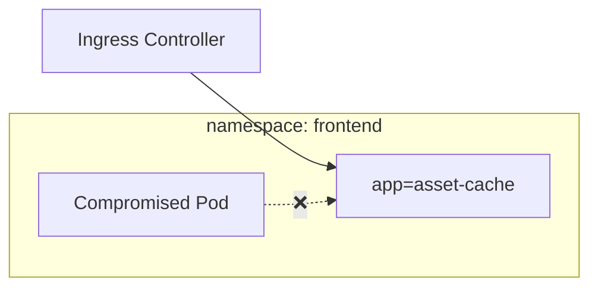
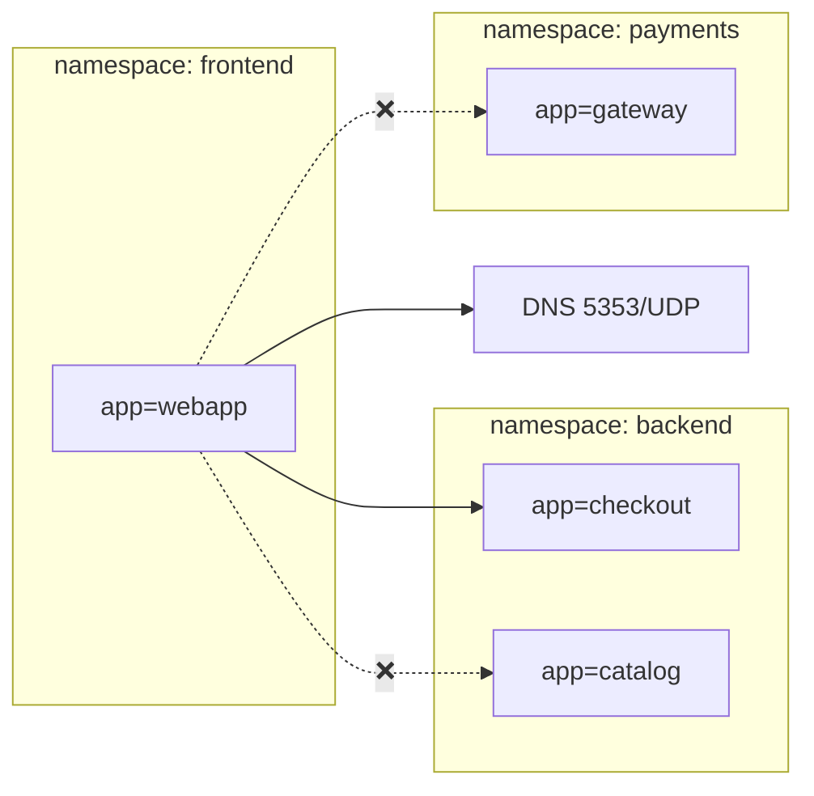
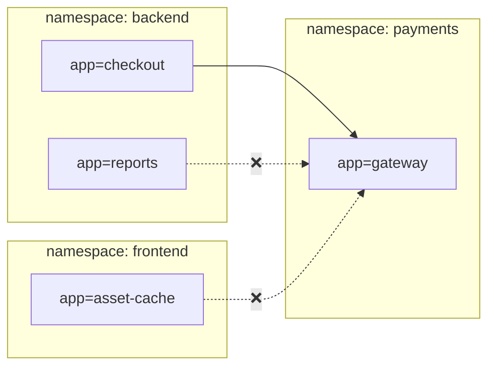
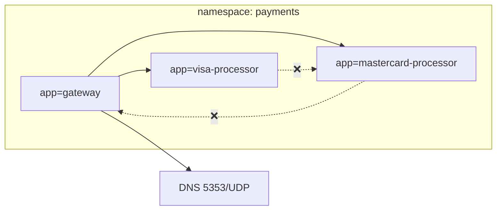
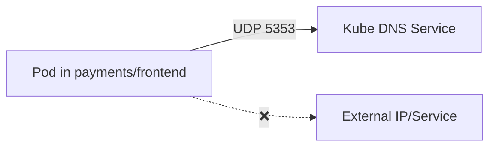

# Network Segmentation for Defense

This guide applies Network Policies to enforce **Zero Trust** between critical application tiers (`frontend`, `payments`) to block the lateral movement attack path: `asset-cache` $\rightarrow$ `visa-processor`.

## Prerequisites

To run this demo, ensure the application stack is deployed:

```bash
git clone https://github.com/ralvares/security-demos
cd security-demos/demo_app/manifests
oc apply -k .
```

## Application Scope & Labels

Your application spans three namespaces: `frontend`, `backend`, and `payments`. We are applying strict isolation to the perimeter (`frontend`) and the critical zone (`payments`).

| Namespace | Key Application Labels | Purpose |
| :--- | :--- | :--- |
| **`frontend`** | `app: webapp`, `app: asset-cache` | Public perimeter / Entry point |
| **`backend`** | `app: checkout`, `app: catalog` | Business logic / Transaction bridge |
| **`payments`** | `app: gateway`, `app: visa-processor` | High-value target / Vault |

-----

## Step 1: Establish Zero Trust (Default Deny)

The fundamental step for network protection is to change Kubernetes' default behavior from **Allow All** to **Deny All**. This ensures that any traffic not explicitly whitelisted is blocked, immediately eliminating the attack vector.

### Pattern: Deny All Ingress and Egress

  * **Explanation:** An empty `podSelector: {}` selects every pod in the namespace, and `policyTypes: [Ingress, Egress]` applies the deny rule to all traffic in both directions.
  * **Action:** Apply this policy to **`frontend`** and **`payments`**.

<!-- end list -->

```yaml
# Default Deny for 'frontend' namespace
apiVersion: networking.k8s.io/v1
kind: NetworkPolicy
metadata:
  name: default-deny-in-namespace-frontend
  namespace: frontend
spec:
  podSelector: {}
  policyTypes:
  - Ingress
  - Egress
---
# Default Deny for 'payments' namespace
apiVersion: networking.k8s.io/v1
kind: NetworkPolicy
metadata:
  name: default-deny-in-namespace-payments
  namespace: payments
spec:
  podSelector: {}
  policyTypes:
  - Ingress
  - Egress
```

-----

## Step 2: Secure the Frontend Perimeter

After applying Default Deny, we must add back the legitimate traffic flows. We focus on the compromised service, `asset-cache`, and the primary app entry point, `webapp`.

### Pattern: Allow Ingress from Router

  * **Explanation:** Public-facing applications (`asset-cache`, `webapp`) must only accept traffic from the OpenShift/Kubernetes Ingress Controller (router). This is the only way for external users to access the app.
  * **Why it Matters:** Prevents accidental internal cluster pods from reaching public services directly.

<!-- end list -->



```yaml
# Policy to allow Ingress traffic to 'asset-cache' (and 'webapp')
apiVersion: networking.k8s.io/v1
kind: NetworkPolicy
metadata:
  name: allow-from-openshift-ingress-to-asset-cache
  namespace: frontend
spec: 
  podSelector:
    matchLabels:
      app: asset-cache
  policyTypes:
  - Ingress
  ingress:
  - from:
    - namespaceSelector:
        matchLabels:
          network.openshift.io/policy-group: ingress # OpenShift Router Label
```

### Pattern: Allow Controlled Egress to Backend

  * **Explanation:** The main app (`webapp`) needs to make necessary outbound calls to **`backend`** services (like `checkout`, `reports`, etc.). Critically, we allow communication only to the **`backend`** namespace, not the **`payments`** namespace.
  * **Why it Matters:** The `webapp` should never talk directly to the `payments` vault; it must go through the dedicated `checkout` service in the `backend`.

<!-- end list -->



```yaml
# Policy for 'webapp' Egress to 'backend' (Partial example)
apiVersion: networking.k8s.io/v1
kind: NetworkPolicy
metadata:
  name: webapp-netpol
  namespace: frontend
spec:
  podSelector:
    matchLabels:
      app: webapp
  policyTypes:
  - Egress
  egress:
  - ports:
    - port: 8080
      protocol: TCP
    to:
    - namespaceSelector:
        matchLabels:
          kubernetes.io/metadata.name: backend
      podSelector:
        matchLabels:
          app: checkout # Explicitly allows communication to the checkout service only
  - ports:
    - port: 5353
      protocol: UDP # Must allow DNS resolution
```

-----

## Step 3: Harden the Payments Vault

This is the most critical isolation zone. We ensure that only the validated `checkout` service can initiate payment flows.

### Pattern: Gateway as Single Entry Point

  * **Explanation:** The `gateway` is the single authorized entry point into the `payments` namespace. We enforce that only the **`backend/checkout`** pod can reach it.
  * **Why it Matters:** This prevents any pod from `frontend` (like the compromised `asset-cache`) from bypassing the business logic layer and reaching the payment gateway.

<!-- end list -->



```yaml
# Policy for 'gateway' Ingress
apiVersion: networking.k8s.io/v1
kind: NetworkPolicy
metadata:
  name: gateway-netpol
  namespace: payments
spec:
  podSelector:
    matchLabels:
      app: gateway
  policyTypes:
  - Ingress
  ingress:
  - from:
    - namespaceSelector:
        matchLabels:
          kubernetes.io/metadata.name: backend
      podSelector:
        matchLabels:
          app: checkout # ONLY 'checkout' is allowed to call
    ports:
    - protocol: TCP
      port: 8080
```

### Pattern: Internal Processor Lockdown

  * **Explanation:** Payment processors (`visa-processor`, `mastercard-processor`) are strictly internal. They must only accept connections from the trusted **`gateway`** pod within their *same* namespace.
  * **Why it Matters:** This ensures even if a pod in the `backend` or `frontend` were compromised, they cannot communicate directly with the processor, completing the lateral movement defense.

<!-- end list -->



```yaml
# Policy for 'visa-processor' Ingress (Internal only)
apiVersion: networking.k8s.io/v1
kind: NetworkPolicy
metadata:
  name: visa-processor-netpol
  namespace: payments
spec:
  podSelector:
    matchLabels:
      app: visa-processor
  policyTypes:
  - Ingress
  ingress:
  - from:
    - podSelector:
        matchLabels:
          app: gateway # ONLY the local 'gateway' pod can connect
    ports:
    - protocol: TCP
      port: 8080
```

-----

## Step 4: Enabling DNS Resolution (Critical Egress)

When using a Default Deny Egress policy, **DNS lookups are blocked** by default. To ensure the microservices can resolve hostnames (e.g., calling services or external APIs), Egress traffic to the cluster's DNS service on UDP port 53 (or 5353) must be explicitly permitted for every pod that needs it.

### Pattern: Allow Egress for DNS

  * **Explanation:** This Egress rule ensures pods like `gateway` (in `payments`) can still perform necessary hostname lookups without breaking the Default Deny posture.
  * **Why it Matters:** Service connectivity fails silently without this exception.

<!-- end list -->



```yaml
# Example: Adding DNS Egress to the 'gateway-netpol' in the payments namespace
# This snippet modifies the existing policy by including the DNS rule.
apiVersion: networking.k8s.io/v1
kind: NetworkPolicy
metadata:
  name: gateway-netpol
  namespace: payments
spec:
  podSelector:
    matchLabels:
      app: gateway
  policyTypes:
  - Egress # Must be in the Egress section
  egress:
  # All existing Egress rules (e.g., to visa-processor) go here...
  - ports:
    - protocol: TCP
      port: 8080
    to:
    - podSelector:
        matchLabels:
          app: visa-processor
  # --- ADD DNS RULE ---
  - ports:
    - protocol: UDP
      port: 5353 # Common port for KubeDNS
```

## Verification & Testing

Verify that the Network Policies effectively block lateral movement while allowing legitimate traffic.

### 1. Test Blocked Access (Lateral Movement Attempt)

Attempt to access the restricted `visa-processor` service from the compromised `asset-cache` pod in the `frontend` namespace.

```bash
# Get the asset-cache pod name
ASSET_POD=$(oc get pod -n frontend -l app=asset-cache -o jsonpath='{.items[0].metadata.name}')

# Attempt connection (Should FAIL/TIMEOUT)
oc exec -n frontend $ASSET_POD -- curl -s --connect-timeout 5 http://visa-processor-service.payments.svc:8080 >/dev/null && echo "CONNECTION ALLOWED" || echo "CONNECTION BLOCKED"
```

**Expected Result:** `CONNECTION BLOCKED`

### 2. Test Allowed Access (Legitimate Traffic)

Verify that the `gateway` component in the `payments` namespace can still communicate with `visa-processor`.

```bash
# Get the gateway pod name
GATEWAY_POD=$(oc get pod -n payments -l app=gateway -o jsonpath='{.items[0].metadata.name}')

# Attempt connection (Should SUCCEED)
oc exec -n payments $GATEWAY_POD -- curl -s --connect-timeout 5 http://visa-processor-service.payments.svc:8080 >/dev/null && echo "CONNECTION ALLOWED" || echo "CONNECTION BLOCKED"
```

**Expected Result:** `CONNECTION ALLOWED`
