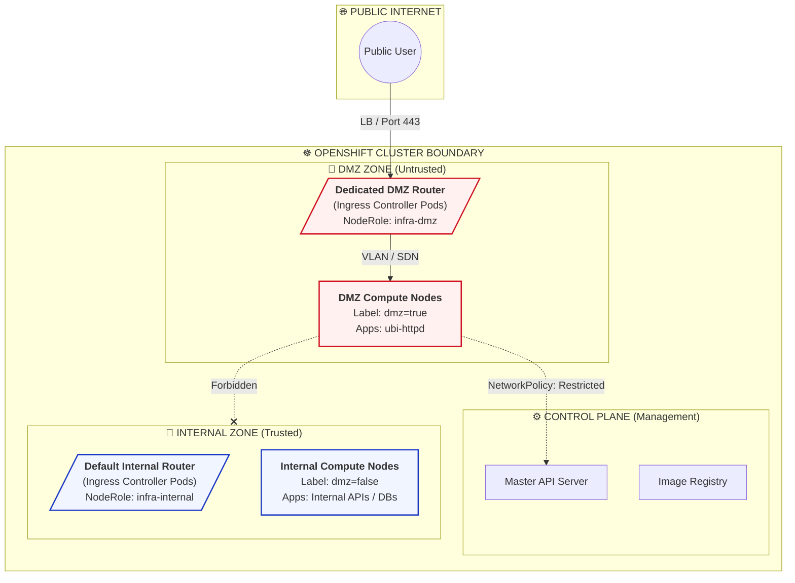

# Network Segmentation and Zone Isolation

Network segmentation is a critical security architectural pattern that involves dividing a network into smaller, distinct sub-networks or "zones". This practice effectively isolates systems based on their function, sensitivity, and risk profile.

### Why Zone Isolation Matters

In a shared infrastructure, an attacker who compromises a single edge service often gains unrestricted visibility and access to internal systems. Segregation mitigates this risk by:

*   **Mitigating Shared Kernel Risks:** Containers on the same node share the host Linux kernel. If a privileged application escapes to the host (container breakout), it could compromise all other applications running on that same node. Segregating risky workloads to dedicated nodes isolates this threat.
*   **Limiting the Blast Radius:** Containing a breach to a specific zone prevents lateral movement to critical internal databases or management planes.
*   **Defense in Depth:** Adding physical or logical separation acts as an additional layer of security beyond authentication and authorization.
*   **Simplifying Compliance:** Isolating data subject to regulations (like PCI-DSS or HIPAA) reduces the scope of audits.
*   **Traffic Control:** Enforcing strict rules on what traffic can flow between zones (e.g., DMZ to Internal).

This guide demonstrates how to implement physical and logical isolation in OpenShift using Node Selectors and Namespaces.

---

### 0. Setup: Create Namespace & Label Node

First, let's set up the environment by creating the namespace and defining the node label.

**1. Create the Namespace:**

```bash
oc create ns dmz
```

**2. Force Pods to the DMZ Zone:**
Patch the namespace configuration. This ensures that every pod deployed in `dmz` automatically gets the `nodeSelector: dmz=true` applied to it, even if the deployment yaml doesn't specify it.

```bash
oc patch ns dmz -p '{"metadata":{"annotations":{"openshift.io/node-selector":"dmz=true"}}}'
```

**3. Designate a DMZ Node:**
Select a worker node to serve as the physical isolation zone.

```bash
# Select a node to label
oc get nodes

# Apply the label (replace <node_name>)
oc label node compute-0 dmz=true
```

---

### 1. The Demo: Deploy and Verify

Since we have already labeled our node `dmz=true` and patched the `dmz` namespace, any pod we create here will be forced onto that specific hardware.

**Deploy the pod:**

```bash
oc run dmz-app --image=registry.access.redhat.com/ubi8/httpd-24 -n dmz

```

**Check where it is running:**

```bash
oc get pod dmz-app -n dmz -o wide

```

In the output, look at the **NODE** column. It will match the specific node you labeled. If you try to deploy this same pod in a different namespace (e.g., `default`), it would land on an internal node instead.

---

### 2. Concept: Nodes and Node Groups

In OpenShift, **Nodes** are the physical or virtual machines where your code actually runs. By default, OpenShift treats all worker nodes as a single "pool" of resources.

However, for security classifications, we use **Node Groups** (logical sets of nodes) to create isolation boundaries:

* **Default Behavior (Shared):** Without configuration, a "high-risk" web app and a "sensitive" internal database could run on the same CPU, sharing the same RAM and Linux kernel.

* **Dedicated Groups:** By using labels (like `dmz=true`), we slice the cluster into specialized zones.

* **Infrastructure Nodes:** A best practice involves dedicating specific nodes solely for platform components, most notably the **Ingress Controllers** (Router). Since the Ingress Controller is the front door handling all incoming HTTP/HTTPS traffic and TLS termination, isolating it ensures that high-load application logic cannot starve the routing layer of resources. It also creates a security boundary where the "traffic handling" layer is physically separate from the "business logic" layer.



#### Why we do this (Classification Logic):

1. **Blast Radius:** If an internet-facing app is compromised via a zero-day exploit, the attacker is "trapped" on the DMZ nodes. They cannot easily use kernel exploits to jump to pods on internal nodes because those pods aren't physically there.

2. **Kernel Isolation:** While Namespaces and SCCs provide *logical* isolation, the **Kernel** is a shared component. Dedicated nodes ensure that sensitive data never enters the memory space of a machine that is processing untrusted internet traffic.

#### A Note on Taints and Tolerations

Another common Kubernetes isolation mechanism involves **Taints and Tolerations**:

*   **Taints** are applied to a Node to "repel" pods. They act like a "Do Not Enter" sign.
*   **Tolerations** are applied to a Pod to keycard through that sign.

**We are NOT using Taints in this specific demo.** Instead, we rely on **Node Selectors** (Affinity). While Taints are excellent for ensuring *other* workloads don't accidentally land on your node (repulsion), Node Selectors are the primary mechanism to force your specific workload *onto* a target node (attraction). For this guide, directing our DMZ traffic to the DMZ node via `NodeSelectors` is the primary control.

---

### 3. Summary of the Security Stack

When you combine these features, you create a "Hardened" environment:

| Feature | Level | Purpose |
| --- | --- | --- |
| **Namespaces** | Logical | Keeps teams from seeing each other's configuration. |
| **SCC (`restricted-v2`)** | Process | Strips the container of "Root" powers and dangerous system calls. |
| **Node Selectors** | **Physical** | Ensures "Exposed" apps never share a kernel with "Internal" apps. |

### The "Best Flow" Reality

By using the **Namespace Node Selector** method we set up, you have implemented a "Guardrail." The classification is enforced at the platform level—even if a developer makes a mistake in their deployment code, the platform will force the application to stay in its designated zone.
