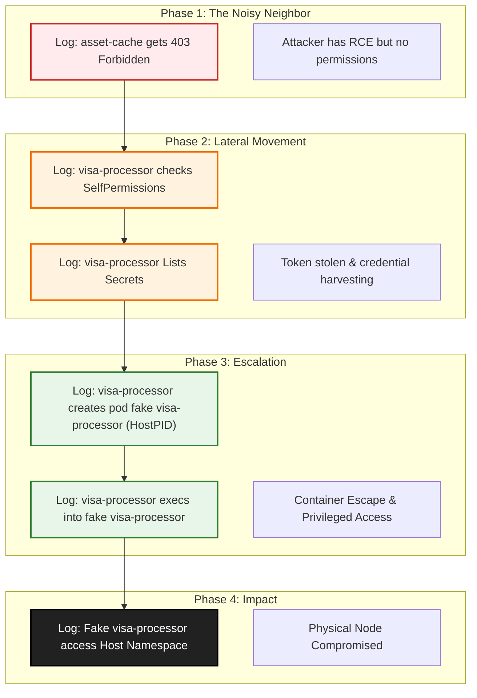

# Forensic Engineering: The OpenShift Audit Log Investigation

## 1. Overview

Audit logs in OpenShift are the authoritative, tamper-evident record of every API request processed by the control plane. Each entry captures **who** performed the action, **what** they did, **when** it occurred, **where** in the cluster it happened, and **how** the request was evaluated.

Properly enabled and analyzed, these logs form the backbone of threat detection, incident response, compliance evidence, and continuous-monitoring programs.

### Why Audit Logs Are Critical

*   **Credential Abuse:** Attackers "log in" with stolen tokens and run standard API calls.
*   **Privilege Escalation:** Misconfigured RoleBindings that silently lift permissions.
*   **Lateral Movement:** Cross-namespace secret reads are often visible only in audit metadata.
*   **Policy Drift:** Excessive SecurityContextConstraints (SCC) exemptions.

## 2. Audit Log Structure

Audit events are emitted as JSON objects. Under the **Default** profile, only metadata is captured; request bodies are omitted.

| Field | Description | Example |
| :--- | :--- | :--- |
| `timestamp` | Time the API server received the request. | `2025-07-02T10:15:00Z` |
| `user.username` | User / service-account identity. | `system:serviceaccount:default:default` |
| `user.groups` | Groups attached to the identity. | `["system:serviceaccounts","system:authenticated"]` |
| `sourceIPs` | Source IP address(es). | `["10.128.0.45"]` |
| `verb` | API verb. | `get`, `create`, `delete`, `patch` |
| `objectRef.resource` | Target resource kind. | `secrets`, `pods`, `rolebindings` |
| `objectRef.namespace` | Namespace (project). | `production` |
| `subresource` | Subresource acted on. | `exec`, `portforward` |
| `responseStatus.code` | Result of the request. | `200` (OK), `403` (Forbidden) |
| `annotations` | RBAC decision, PodSecurity/SCC match. | `"authorization.k8s.io/decision":"allow"` |

> **Note:** Request bodies for **Secret**, **Route**, and **OAuthClient** are *never* logged in any profile.

## Part 1: The Immutable Truth (Revised)

In any production cluster, observability is crucial. Metrics such as CPU usage and memory consumption provide insights into the **health** of applications. However, during a security incident, the focus shifts from **health** to **accountability** and **intent**.

Audit logs serve as the definitive record of actions within the cluster. They are the authoritative record of the Control Plane, capturing the **5 Ws** of every interaction with the API Server: **Who**, **What**, **Where**, **When**, and the **Decision** (RBAC).

## Prerequisite 1: Storage Integrity (The "Safe")

Before we start the hunt, we must address the most important rule of forensic logging: **Storage Integrity.**

Audit logs are generated on the Master nodes. If an attacker successfully escalates privileges and takes over the node (Root compromise), they can wipe the log files. Therefore, for these logs to be legally and forensically valid, they **must be forwarded** to an external system (Splunk, Elastic, Remote Syslog).

## Prerequisite 2: The Audit Profile (The "Resolution")

Secure logs are useless if they don't contain enough detail. This is defined by the **Audit Log Policy**.

By default, OpenShift uses the **Metadata** profile. This is like a phone bill: it tells you *who* called *whom* and for *how long*, but it does not record the *conversation*.

For a deep forensic investigation—where we need to see the exact commands an attacker ran (`exec`), the malicious image they pulled, or the IP address assigned to their pod—we require a higher resolution: **Request Bodies**.

| Profile | Forensic Visibility | What you see | What you miss |
| :--- | :--- | :--- | :--- |
| **Default** | Low | Metadata (User, Verb, Resource, Response Code). | **The Payload.** You cannot see the pod spec (hostPID), the specific command arguments, or the IP assignment in status updates. |
| **WriteRequestBodies** | **High (Recommended)** | All Metadata + **The Full Payload** for "Write" actions (Create, Update, Patch). | Read payloads (e.g., you can't see *which* secret specifically was read if looking at the body, but you know a read happened). |
| **AllRequestBodies** | Maximum | Everything. | Nothing. (Extremely high storage cost). |

> **Forensic Note:** For this investigation, we assume the cluster was configured with **`WriteRequestBodies`**. This allows us to see the "Smoking Gun" evidence: the malicious `hostPID` flag in the pod creation request and the exact IP address assigned by the Node.

-----

## Part 2: The Incident Scenario

We are investigating a suspected breach of our "Visa Payment" application. Intelligence suggests a sophisticated Kill Chain involving two specific workloads:

  * **Frontend:** `asset-cache` (Namespace: `frontend`)
  * **Payments:** `visa-processor` (Namespace: `payments`)

**The Attack Theory:**

1.  **Application Exploit:** The attacker exploited a vulnerability in the `asset-cache` code. Because this is an application-level exploit, **the Audit Log is blind to it**.
2.  **The "Loud" Failure:** The attacker tried to talk to the API from `asset-cache` but failed because that account is locked down.
3.  **Lateral Movement:** They pivoted to the `visa-processor`, stole the token, and found it had `cluster-admin` rights due to a misconfiguration in the RoleBinding, which granted excessive privileges to the service account.
4.  **The Trigger:** The moment the attacker uses that stolen token to talk to the OpenShift API, they step out of the shadows and into our logs.

We will now switch to the terminal to reconstruct this timeline using **Behavioral Analysis**.

-----

## Part 3: The Investigation

### Setup: Load the Forensic Library

Before we begin, we will load our forensic toolkit. This library contains pre-built functions to query the audit logs efficiently.

```bash
source forensics.sh
```

### Step 1: Investigating the Entry Point

We begin our investigation by looking for suspicious anonymous API activity originating from within the cluster. Our first clue is a set of `403 Forbidden` audit log entries where the `user` is `system:anonymous` and the `sourceIPs` field contains an address from the pod network (e.g., `10.128.x.y`).

By focusing on these events, we can identify API requests that likely originated from a pod, rather than from a node, router, or external source. This method allows us to attribute activity to in-cluster workloads and is a common first step in forensic analysis.

Once we identify a pod IP making these anonymous requests, we can correlate it to a specific workload. 

At this stage, we search for anonymous `403 Forbidden` attempts from the pod network:

```bash
audit_detect_anonymous_access audit.log
```

Explanation: Understanding `sourceIPs`
- The audit field `sourceIPs` reflects the IPs observed by the API server for the client connection. In most cases, the first element is the pod IP (e.g., `10.128.x.y`).
- For deeper enrichment, OpenShift Network Observability can link the IP to the pod/workload, namespace, and node, providing a quick pivot from IP → pod → owner.


#### Network Identity

Finally, to correlate network flows with these events, we need to know the IP address assigned to the malicious pod at the time of creation. In OpenShift/OVN, this is stored in the `k8s.ovn.org/pod-networks` annotation.

**The Query:**
```bash
TARGET_IP=10.128.1.81
audit_lookup_pod_by_ip audit.log $TARGET_IP
```

**The Finding:**
This reveals the ephemeral IP address assigned to the asset-cache pod.

#### About the asset-cache Pod

Through this correlation, we determined that the suspicious pod IP belonged to the `asset-cache` pod in the `frontend` namespace. The `asset-cache` application is a stateless frontend cache service, typically exposed to external traffic and designed to improve performance by storing frequently accessed data. In this scenario, it was running with minimal privileges and, crucially, did not mount a Kubernetes service account token.

This lack of a service account token meant that any API requests made from the pod would be anonymous. The attacker exploited a remote code execution (RCE) vulnerability in the `asset-cache` application, allowing them to run arbitrary commands inside the pod. Their first attempts to access the Kubernetes API were therefore made as `system:anonymous`, and were blocked by RBAC, as seen in the audit logs.

Only after linking the pod IP to the `asset-cache` workload did we realize this was the initial entry point for the attack chain. This highlights the importance of correlating network-level evidence with workload metadata during forensic investigations.

**The Finding:**
We see multiple entries. The attacker tried to `list secrets` and `get pods` from the `asset-cache` pod, but OpenShift blocked them (403).

  * **Forensic Insight:** This confirms the pod is compromised, but the attacker hit a wall. They need a valid account.

#### Investigating the IP History (The Identity Switch)

Now that we have a suspicious IP (`10.128.1.81`), we must ask: **"Did this IP ever succeed?"**

We run a history check on this specific IP to see if it ever made a request with a *valid* identity. This is how we detect if the attacker managed to steal a token and use it from the compromised pod.

```bash
TARGET_IP="10.128.1.81"
audit_track_ip_activity audit.log $TARGET_IP
```

**The Finding:**
We observe a critical shift. The logs show initial `system:anonymous` failures (403), followed by successful requests (200) authenticated as `system:serviceaccount:payments:visa-processor`.

**Conclusion:** The attacker did not just stay in `asset-cache`. They stole the token of the `visa-processor` service account and are using it *from* the `asset-cache` pod (or they moved to the `visa-processor` pod, but the IP correlation suggests the former if the IP matches). *Note: If the IP changed, we would track the new IP.*

### Step 2: Tracking the Compromised Identity (The Full Picture)

Exploiting the lack of NetworkPolicies, the attacker moved laterally to the `visa-processor` pod and abused a known vulnerability in its outdated Apache Struts to gain access and steal the token.

Now that we have identified the compromised account (`system:serviceaccount:payments:visa-processor`), we don't need to run individual detection scripts for every possible attack vector. We can simply ask the audit log: *'What did this user do?'*

```bash
audit_track_user_activity audit.log system:serviceaccount:payments:visa-processor
```

**The Finding:**
The output reveals the entire Kill Chain in chronological order:

1.  **Reconnaissance:** `create selfsubjectaccessreviews`. The attacker checked their own permissions.
2.  **Credential Harvesting:** `list secrets`. The attacker dumped all secrets in the cluster.
3.  **Privilege Escalation:** `create pods`. The attacker created a pod named `visa-processor` in the `payments-v2` namespace.
4.  **Lateral Movement/Persistence:** `create pods/exec`. The attacker opened an interactive shell into that pod.

This single command confirms the attacker moved from simple discovery to active exploitation and established a backdoor.

This led to the final, critical chapter of the investigation: **The Node Compromise**.

-----

### Step 3: The Node Takeover

> **Note:** The following forensic analysis assumes that your audit log profile is set to capture request bodies (e.g., `WriteRequestBodies` or `AllRequestBodies`). Without this, you will not see the full pod spec, container image, or command in the audit log. Since pods are often short-lived, other methods (such as external SIEM, EDR, or node-level forensics) are required to reconstruct the attack if audit bodies are not available.

At this stage, the attacker has achieved a privileged foothold inside the `visa-processor` pod, which was created with both `hostPID: true` and `privileged: true`. These settings effectively remove most container boundaries, granting the attacker visibility and control over the host node's processes and resources.

The next move is inferred from the pod specification: the attacker likely attempts to escape the container namespace and access the host's filesystem and process space. While we often suspect tools like `nsenter`, the audit log does not capture what happens inside the container. Instead, we rely on forensic signals from the pod spec:

- **Pod creation with `hostPID` and `privileged`**: The audit log shows the creation of a pod with these dangerous settings, a strong indicator of an attempted container escape.
- **Suspicious or unusual commands**: If the audit log profile captures request bodies, you can see the full command array used to launch the container. Any command that attempts namespace manipulation (e.g., `nsenter`, `chroot`, `mount`, or custom binaries) is a red flag, but even generic shells (`/bin/bash`, `/bin/sh`) in privileged pods should be scrutinized.
- **Container image used**: The audit log also reveals the image specified for the pod. Unusual or minimal images (like `alpine`, `busybox`), or images not normally used in your environment, can indicate attacker activity or attempts to evade detection.
- **Sensitive hostPath mounts**: The attacker may also mount critical host directories (like `/`, `/etc`, `/var/run`, `/root`, or `/etc/kubernetes`) into the pod, providing direct access to the node's files.

By reviewing the pod spec in the audit log, you can:
* See the exact container image and command used, providing context for the attacker's intent and tooling—without needing to guess the method (e.g., `nsenter`).
* Correlate suspicious images and commands with dangerous settings (`hostPID`, `privileged`, sensitive hostPath mounts) to build a high-confidence picture of a node compromise attempt.

Once on the node, the attacker can:
* Read or modify sensitive files.
* Create or alter static pod manifests for persistence.
* Access container runtime sockets to control other containers or escalate further.
* etc..

**Forensic Implications:**
While the actual use of escape tools and subsequent host actions are not visible in Kubernetes audit logs, the combination of these pod creation events, dangerous settings, suspicious commands, unusual images, and sensitive mounts is a high-fidelity signal of node compromise. The queries below help you spot these behaviors.

```bash
POD_NAME="visa-processor"
audit_track_pod_lifecycle audit.log $POD_NAME
```

**The Finding:**
We see the pod created with a command that explicitly invokes `nsenter`, confirming the attacker's intent to escape the container and access the host.

-----

## Forensic Timeline

We have now reconstructed the *entire* Kill Chain, from the first failed probe to total infrastructure compromise.



## Conclusion

We have reconstructed the crime scene using only the Audit Logs, mapping the attack to the **MITRE ATT\&CK** framework:

1.  **Asset-Cache (Frontend):** `403 Forbidden` on API calls. *Conclusion: Compromised, but contained by RBAC.*
2.  **Visa-Processor (Lateral Move):** `SelfSubjectAccessReview`. *Conclusion: Token stolen, Reconnaissance detected.*
3.  **Visa-Processor (Exfiltration):** `List Secrets`. *Conclusion: Credential Harvesting.*
4.  **Visa-Processor (Escalation):** Deployed `fake visa-processor` with `HostPID`. *Conclusion: Container Escape.*
5.  **Visa-Processor (Action):** Executed shell in `fake visa-processor`. *Conclusion: Node Takeover.*